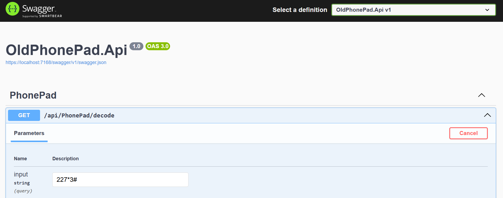
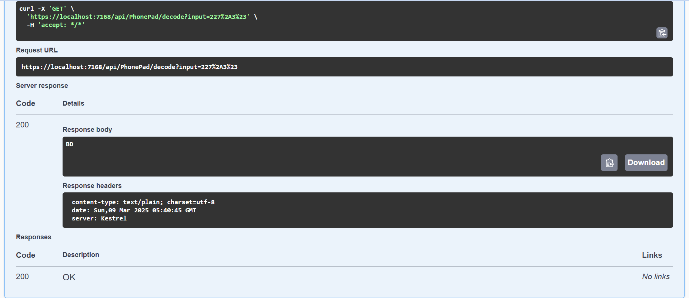

# Old Phone Pad Decoder

## Overview

The **Old Phone Pad Decoder** is a .NET-based application that simulates the decoding of input from an old phone keypad. The application takes a sequence of numbers and special characters (like `*` for backspace and `#` for end of input) and decodes it into a readable string based on the traditional phone keypad mapping.

This project is structured using a clean architecture approach, separating concerns into different layers such as Domain, Application, Infrastructure, and Presentation. It also includes unit tests to ensure the correctness of the decoding logic.

---

## Features

- **Decoding Logic**: Converts sequences of numbers into letters based on the old phone keypad layout.
- **Backspace Support**: The `*` character acts as a backspace, removing the last decoded character.
- **End of Input**: The `#` character signifies the end of the input sequence.
- **REST API**: Provides an HTTP endpoint to decode input strings.
- **Unit Tests**: Includes comprehensive unit tests to validate the decoding logic.

---

## Keypad Mapping

The keypad mapping is as follows:

| Number | Letters       |
|--------|---------------|
| 2      | A, B, C       |
| 3      | D, E, F       |
| 4      | G, H, I       |
| 5      | J, K, L       |
| 6      | M, N, O       |
| 7      | P, Q, R, S    |
| 8      | T, U, V       |
| 9      | W, X, Y, Z    |

- Pressing a number once corresponds to the first letter, twice to the second letter, and so on.
- A space (` `) is used to separate sequences of the same number.

---

## Getting Started

### Prerequisites

- [.NET 6 SDK](https://dotnet.microsoft.com/download/dotnet/6.0)
- An IDE or text editor (e.g., Visual Studio, Visual Studio Code, or JetBrains Rider)

### Installation

1. Clone the repository:
   ```bash
   git clone https://github.com/kelumkp/old-phone-pad-decoder.git
   cd old-phone-pad-decoder
   ```

2. Build the project:
   ```bash
   dotnet build
   ```

3. Run the application:
   ```bash
   dotnet run --project OldPhonePad.Api
   ```

4. The API will be available at `https://localhost:5001` (or `http://localhost:5000`).




---

## Usage

### Decoding Input via API

Send a `GET` request to the `/api/PhonePad/decode` endpoint with the input as a query parameter.

Example:
```bash
curl -X GET "https://localhost:5001/api/PhonePad/decode?input=4433555%20555666%23"
```

Response:
```json
"HELLO"
```

### Example Inputs and Outputs

| Input               | Output  |
|---------------------|---------|
| `33#`               | `E`     |
| `227*#`             | `B`     |
| `4433555 555666#`   | `HELLO` |
| `2 22 222#`         | `ABC`   |
| `7777 9999#`        | `SZ`    |
| `227*3#`            | `BD`    |

---

## Project Structure

The project is organized into the following layers:

1. **Domain**: Contains the core business logic, including the `PhonePadDecoder` class.
2. **Application**: Implements the service layer (`IPhonePadService`) and application logic.
3. **Infrastructure**: Provides data mappings (e.g., `KeyPadMapping`).
4. **Api**: Contains the REST API controller (`PhonePadController`).
5. **Tests**: Includes unit tests for the decoding logic.

---

## Running Tests

To run the unit tests, use the following command:
```bash
dotnet test
```

---

## Contributing

Contributions are welcome! Please follow these steps:

1. Fork the repository.
2. Create a new branch for your feature or bugfix.
3. Commit your changes and push to the branch.
4. Submit a pull request.

---

## License

This project is licensed under the MIT License. See the [LICENSE](LICENSE) file for details.


---